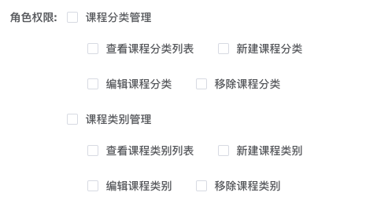

##### 1.针对 Element 的 InputNumber 组件，无法限制【-】符号输入

```js
// 不可输入中文，英文，特殊符号
<el-input v-model='sort' oninput="value=value.replace(/[^\d]/g,'')" />
```

##### 2.字符串转 Number 类型的数组

```js
'1,2,3,4'.split(','); // ["1", "2", "3", "4"]
'1,2,3,4'.split(',').map(Number); // [1, 2, 3, 4]
```

#### 3.菜单权限 && 按钮权限

> 后台管理系统，业务需求，根据用户权限，自定义配置可见菜单和可见按钮

思路：

- 1.前端选择可见菜单组成数据结构。用户新登录的时候，获取可见菜单的列表数据，渲染用户拥有的侧边拦菜单
- 2.前端选择可见按钮组成数据结构。用户进入页面显示可见按钮，使用 vue-指令根据是否拥有按钮权限来控制显示
- 3.前端自己组装数据结构，页面关联页面下按钮，保持页面与按钮的一致

##### 设计按钮文案

```js
// 定义按钮权限 按钮，文案对应关系
let btnsNames = {
  class: {
    list: '查看课程列表',
    add: '新建课程',
    edit: '编辑课程',
    remove: '移除课程',
  },
};
// 筛选 按钮文案
export function filterName(path, btn) {
  return btnsNames[path][btn];
}
```

##### 设计菜单与按钮渲染数据接口

```js
// 设置菜单-按钮 权限表
const pageOptions = [
  {
    name: '课程分类管理', // 名称
    path: 'class', // 路径
    parent: '/class-manage', // 父级路径
    checkOptions: [], // 选中按钮数组
    btnOptions: ['list', 'add', 'edit', 'remove'], // 所有按钮数组
    checkAll: false, // 是否全选
    isIndeter: false,
  },
];
```



##### 选择完成权限后，前端组合数据结构，然后保存到后端

```js
let permission = [
  {
    name: '课程分类管理',
    path: 'class',
    parent: '/class-manage',
    btnOptions: ['list', 'add', 'edit', 'remove'],
  },
  {
    name: '课程类别管理',
    path: 'category',
    parent: '/class-manage',
    btnOptions: ['list', 'add', 'edit', 'remove'],
  },
];
```

##### 登录后，获取用户的权限数据，进行渲染显示（侧边栏菜单和按钮）

```js
/**
 * 用户菜单权限——筛选用户拥有菜单路由
 * @param {*} allRouter 系统所有路由表
 */
export function filterRouters(allRouter) {
  let selectRouter = getPermission(); // 用户拥有的路由权限
  let routers = [];
  for (const allItem of allRouter) {
    let { path, meta } = allItem;
    let parentObj = { path, meta };
    let ch = [];
    for (const cItem of allItem.children) {
      for (let selectItem of selectRouter) {
        if (
          allItem.path === selectItem.parent &&
          cItem.path === selectItem.path
        ) {
          let { path, meta } = cItem;
          ch.push({ path, meta });
        }
      }
    }
    if (ch.length) {
      parentObj.children = ch;
      routers.push(parentObj);
    }
  }
  // routers.push({ path: "*", redirect: "/404", hidden: true });
  return routers;
}
```

> 使用上面过滤数据，在侧边栏组件中进行渲染，即可看到用户拥有的菜单

##### 按钮指令

```js
/**
 * v-has指令——是否拥有按钮权限
 * @param {*} path 菜单路径
 * @param {*} btn 按钮名
 */
export const hasPermission = (path, btn) => {
  let permission = getPermission();
  let list = permission.find((p) => p.path === path);
  let btns = list && list.btnOptions;
  return btns && btns.includes(btn);
};
```
