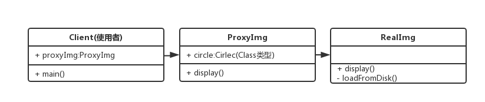

#### 代理模式
**介绍**
- 使用者无权访问目标对象
- 中间加代理，通过代理做授权和控制 

**示例**
- 科学上网，访问githunb.com

**UML类图**


**代码演示**
```js
class ReadImg {
    constructor(fileName) {
        this.fileName = fileName
        this.loadFromDisk()
    }
    display() {
        console.log('....')
    }
    loadFormDisk() {
        console.log('....')
    }
}
class ProxyImg{
    constructor(fileName) {
        this.realImg = new ReadImg(fileName)
    }
    display() {
        this.realImg.display()
    }
}
//测试
let proxyImg = new ProxyImg('1.png')
proxyImg.display()
```

**场景**
- 网页事件代理
- jQuery $.proxy
- ES6 Proxy
**网页事件代理**
```html
<div id="div1">
    <a href="#">a1</a>
    <a href="#">a2</a>
    <a href="#">a3</a>
    <a href="#">a4</a>
</div>
```
```js
var div1=document.getElementById('div1')
div1.addEventListener('click', function(e) {
    var target = e.target
    if(target.nadeName === 'A'){
        alert(target.innerHTML)
    }
})
```
**$.proxy**
```js
$('#div1').click(function() {
    //this 符合期望
    $(this).addClass('red')
})
$('#div').click(function() {
    setTime(function() {
        //this 不符合期望
        $(this).addClass('red')
    },1000)
})
```
```js
//可以使用如下方式解决
$('#div1').click(function() {
    var _this=this;
    setTime(function() {
        //_this 符合期望
        $(_this).addClass('red')
    },1000)
})
```
```js
//但推荐使用 $.proxy 解决， 这样就少定义一个变量
$('#div').click(function() {
    setTimeout($.proxy(function() {
        //this 符合期望
        $(this).addClass('red')
    }, this), 1000)
})
```

**ES6 Proxy**
```js
//明星
let star = {
    name:'李',
    age:25,
    phone:13567899876
}
//经纪人
let agent= new Proxy(star, {
    get: function(target, key) {
        if(key === 'phone') {
            //返回经纪人手机号
            return '13212344321'
        }
        if(key === 'price') {
            //明星不保价，经纪人报价
            return 120000
        }
        return  target[key];
    }
    set: function(target, key, val) {
        if(key === 'customPrice') {
            if(val < 100000) {
                throw new Error('价格太低')
            } else{
                target[key] = val;
                return true;
            }

        }
    }
})
//test 
console.log(agent.name)
console.log(agent.age)
console.log(agent.phone)
console.log(agent.price)
```

**设计原则验证**
- 代理类和目标类分离，隔离开目标类和使用者
- 符合开放封闭原则

**代理模式VS适配器模式**
- 适配器模式：提供一个不同的接口
- 代理模式：提供一模一样的接口

**代理模式VS修饰器模式**
- 修饰器模式：扩展功能，原有功能不变且可直接使用
- 代理模式：显示原有功能，但是经过限制或者阉割之后的